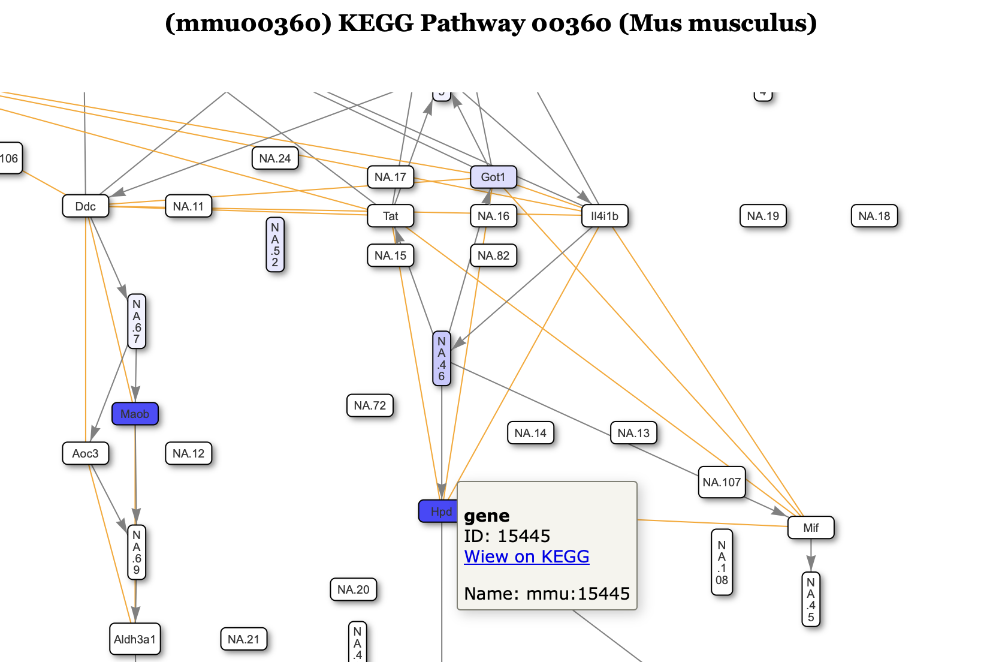

# KEGGGraph

A package to create interactive graphs from KEGG pathways and map differential expression results onto them.

## Installation

```R
install.packages("devtools")     
devtools::install_github("edoardofilippi/KEGGgraphs")
```
## Usage

```R
library(KEGGgraphs)

transcriptomics_res$KEGGID <- ensembl_to_kegg(transcriptomics_res$id, organism = "mouse")
proteomics_res$KEGGID <- uniprot_to_kegg(proteomics_res$uniprot_id, organism = "mouse")

de_results_list = list(
  trans = list(
    de_table = transcriptomics_res, 
    value_column = "log2FoldChange", 
    feature_column = "KEGGID", 
    threshold = 0.2),
  prot = list(
    de_table = proteomics_res, 
    value_column = "logFC", 
    feature_column = "KEGGID", 
    threshold = 0.2),
  metabo = list(
    de_table = metabolomics_res, 
    value_column = "log2FoldChange", 
    feature_column = "rownames", 
    threshold = 0.2))

print(paste0("testing for: ", pathway, " in ", contrast_fea))
devtools::load_all("/Users/edoardofilippi/Development/Projects/KEGGgraphs")
ggkegg_to_visnetwork(pathway, de_results = de_results_list)
```

Example output  

